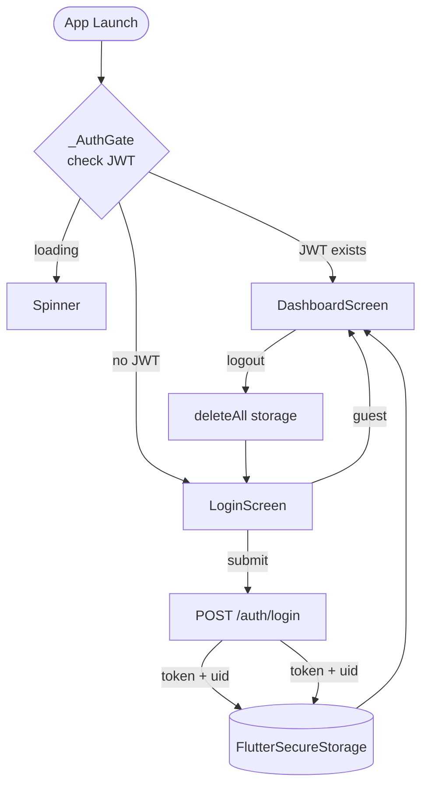
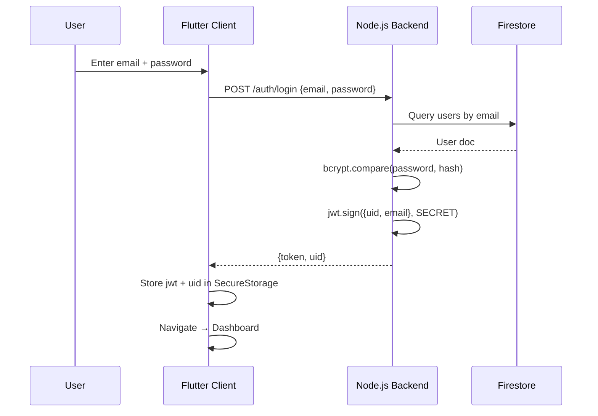
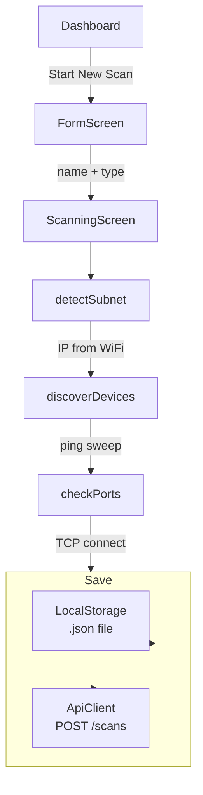
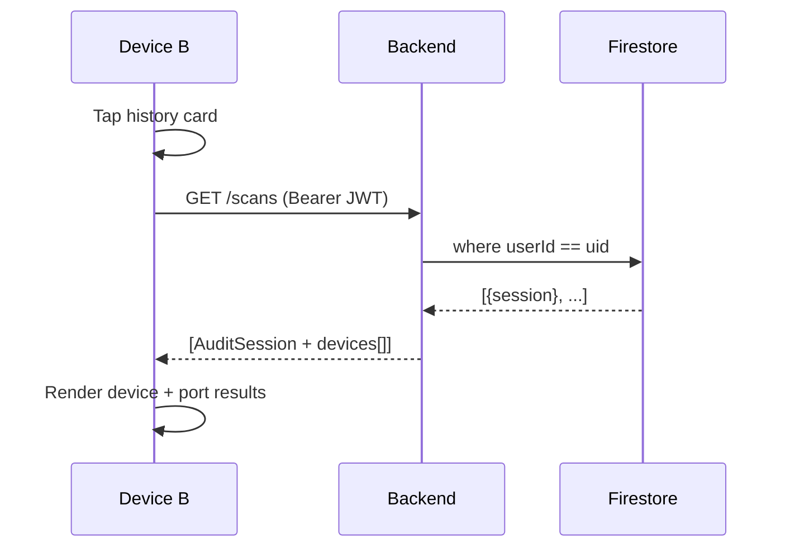
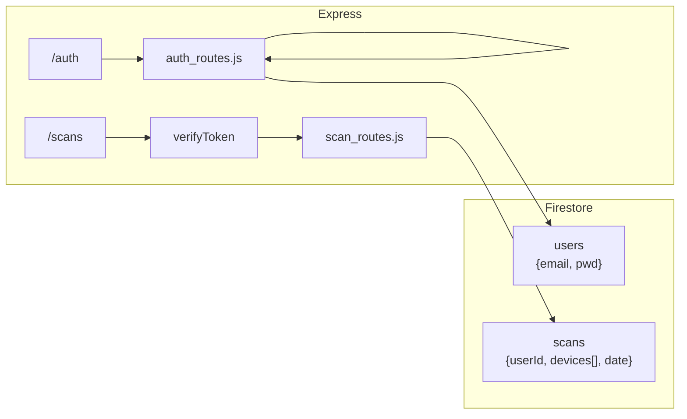
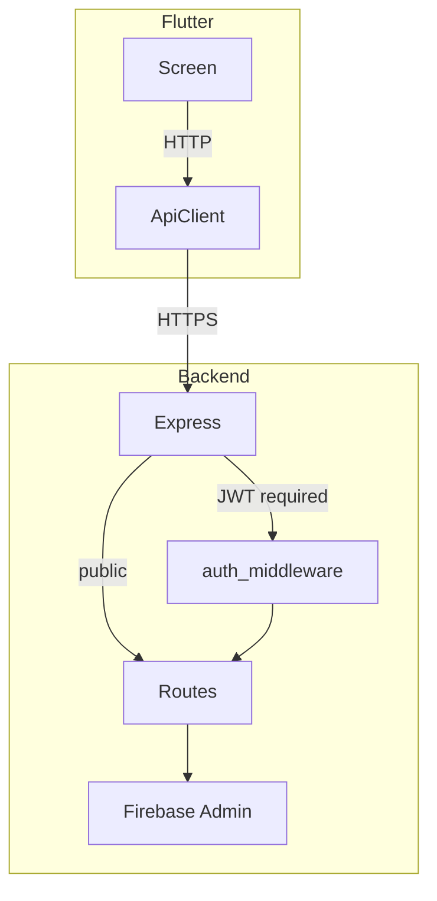

# Responder — System Flow

## App Lifecycle



## Authentication



## Scan Execution



## Scan Detail (Cross-Device)



## Backend Routes



## Data Layer

```mermaid
flowchart TB
    subgraph Client Storage
        SS["FlutterSecureStorage<br/>jwt, uid"]
        LS["Local Filesystem<br/>sessions/{uid}/{id}.json"]
    end

    subgraph Server Storage
        FB["Firestore<br/>users / scans"]
    end

    SS <--auth--> FB
    LS <--offline cache--- FB
```

## Full Request Flow



## File Map

| Layer | File | Purpose |
|-------|------|---------|
| Entry | `lib/main.dart` | _AuthGate, routing |
| UI | `login_screen.dart` | Login form |
| UI | `signup_screen.dart` | Register form |
| UI | `form_screen.dart` | Scan config |
| UI | `scanning_screen.dart` | Scan execution + results |
| UI | `dashboard_screen.dart` | History list |
| Data | `api_client.dart` | HTTP to backend |
| Data | `local_storage.dart` | File persistence |
| Data | `dto/*.dart` | JSON serialize |
| Logic | `scan_repository.dart` | Ping, port scan |
| Backend | `server.js` | Express init |
| Backend | `auth_routes.js` | /auth endpoints |
| Backend | `scan_routes.js` | /scans CRUD |
| Backend | `auth_middleware.js` | JWT verify |
